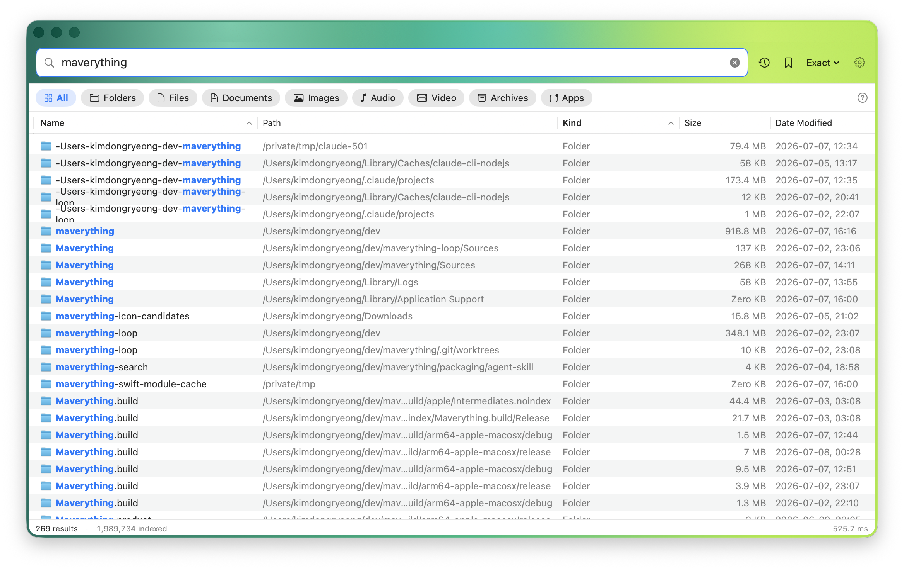
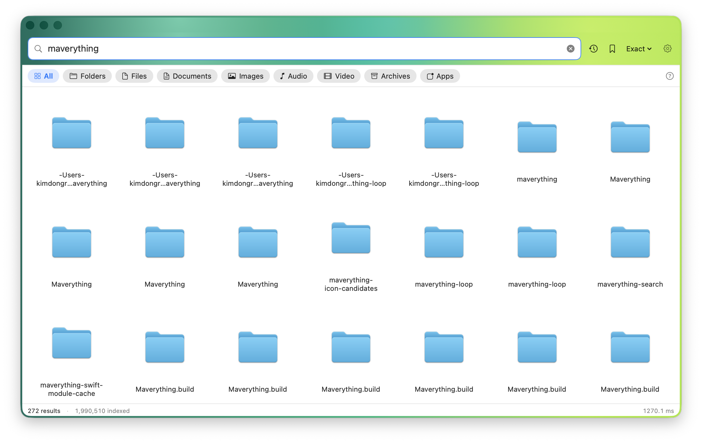
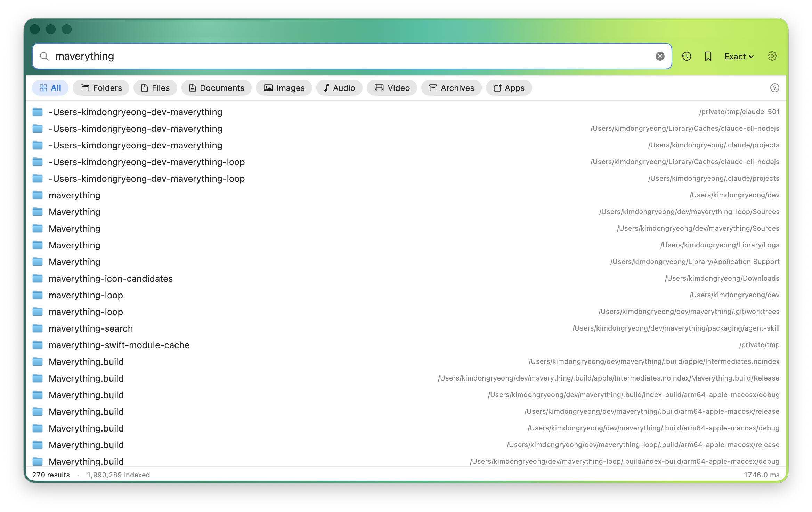
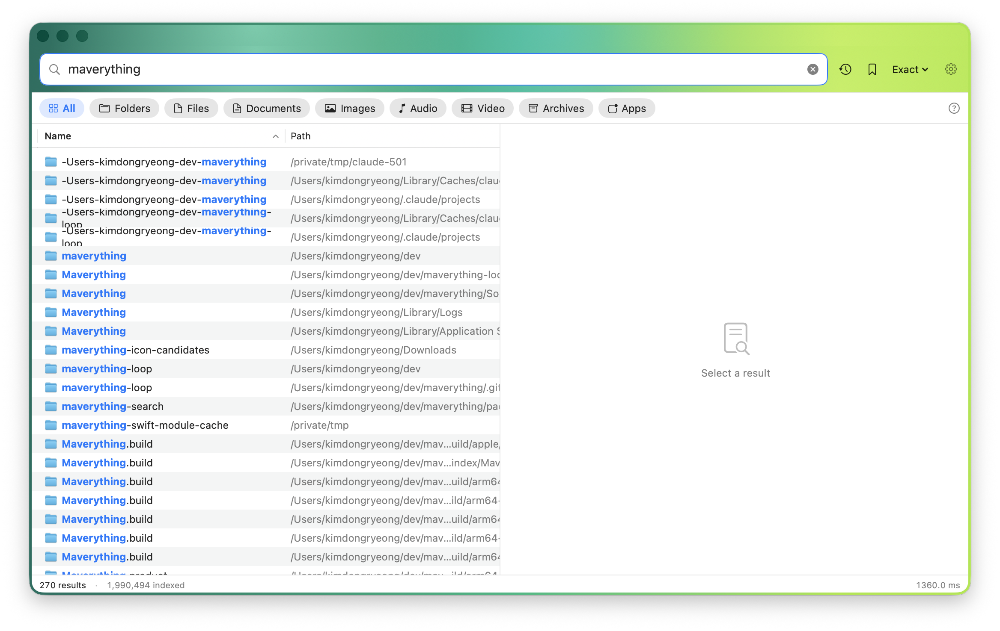

# Maverything

<p align="center">
  
</p>

<h3 align="center">Everything-style instant file search for macOS.</h3>

<p align="center">
  Search every file name on your Mac as you type, including hidden files, system files,
  external volumes, and folders Spotlight does not try to expose.
</p>

<p align="center">
  <a href="https://github.com/kim-dongryeong/maverything/actions/workflows/ci.yml"></a>
  <a href="https://github.com/kim-dongryeong/maverything/releases/latest"></a>
  <a href="LICENSE"></a>
  
  
</p>

<p align="center">
  <a href="https://github.com/kim-dongryeong/maverything/releases/latest"><b>Download the latest DMG</b></a>
  ·
  <a href="docs/RELEASING.md">Release notes / packaging</a>
  ·
  <a href="docs/USE-CASES.md">Use cases</a>
</p>


## Why Maverything Exists

Windows has [Everything](https://www.voidtools.com/): a tiny, instant, exhaustive file-name search tool that power users keep open all day.
macOS has Spotlight, which is excellent for curated content search, but it intentionally skips many hidden, system, and app-private locations and does not behave like an exhaustive live file list.

Maverything is the macOS-native attempt at the Everything mental model:

- every indexed file name in RAM
- matches while you type
- real-time updates through file-system events
- a transparent query syntax
- a native app plus a terminal command and MCP server
- free, GPL-3.0, and auditable

The angle is not "another Spotlight UI." The angle is: if the file exists and your Mac lets an app see it, Maverything tries to make it searchable immediately.

## Screenshots

| Table search | Icon grid |
|---|---|
|  |  |

| Compact bar | Two-pane preview |
|---|---|
|  |  |

## What It Can Do

### Instant File-Name Search

Type a few characters and results update immediately over the in-memory index. Maverything is built around a flat RAM representation of the file tree, cached sort orders, and tight matching loops. On an Apple Silicon M4 with about 3.3 million files:

| Operation | Typical result |
|---|---:|
| Cold whole-disk crawl | about 26-40 s |
| Warm relaunch from snapshot | about 1 s |
| Common per-keystroke queries | about 0.1-3 ms |
| Broad queries over millions of rows | often under 100 ms |

The app persists an LZFSE-compressed binary snapshot at:

```text
~/Library/Application Support/Maverything/index.mvidx
```

On launch, it loads the snapshot first and resumes from the saved FSEvents id. If the snapshot is too old to trust, it reindexes for correctness.

### Everything-Style Query Syntax

You can combine plain text, quoted phrases, negation, file metadata, and type filters:

| Query | Meaning |
|---|---|
| `report pdf` | AND search: both terms must match |
| `"final report"` | quoted phrase |
| `jpg\|png` | OR search |
| `-cache` | exclude matches containing `cache` |
| `ext:png,jpg` | one of several extensions |
| `size:>10mb` | file size comparison |
| `dm:today` | modified today |
| `dm:week` | modified this week |
| `dm:2026-01-31` | modified on a specific date |
| `folder:` | folders only |
| `file:` | files only |
| `path:src` | match the full path |
| `name:data` | force a name match even in path mode |
| `case:on` | case-sensitive search |
| `ww:` | whole-word matching |
| `dupe:` | duplicate file names |
| `content:token` | on-demand content search inside files |
| `tag:red;blue` | Finder tags, OR within a tag clause |
| `type:images` | fast type-class filter |

The toolbar chips emit the same syntax under the hood, so a click on Images is just a readable query fragment instead of a hidden mode.

### Four Result Layouts

Maverything supports four layouts because file search is not one job:

- **Table**: dense scanning, sorting, CSV export, multi-select workflows.
- **Compact bar**: Spotlight-like quick launcher mode.
- **Two-pane preview**: result list plus Quick Look and metadata.
- **Icon grid**: visual browsing for images, folders, apps, and media.

Shortcuts:

| Shortcut | Action |
|---|---|
| `Command-1` | Table |
| `Command-2` | Compact bar |
| `Command-3` | Two-pane preview |
| `Command-4` | Icon grid |
| `Control-1...7` | Sort by name, path, size, modified, created, relevance, run count |
| `Control-0` | Toggle ascending |
| `/` | Focus the search field |
| `Space` | Quick Look |
| `Command-Delete` | Move selected files to Trash |
| `F2` | Rename |
| `Command-R` | Reveal in Finder |

### Finder-Grade Workflow

Maverything is meant to stay open while you work:

- Quick Look with `Space`
- rename in place
- move to Trash
- Get Info
- reveal in Finder
- drag files out of the result list
- Finder tag filters
- CSV export
- saved searches
- recent queries
- global hotkey, default `Option-Space`
- menu-bar extra
- light, dark, and system appearance
- comfortable and compact row density

### Dynamic Volumes and Network Folders

Local APFS volumes are discovered automatically. External drives are indexed on mount and removed from results on unmount.

For places the volume scan does not cover, especially NAS or SMB shares, add **Extra index folders** in Settings. Network shares do not always deliver reliable file events, so Maverything also supports scheduled rescans for those folders.

### Run Count Sort

Maverything tracks files you open from the app and exposes a **Run Count** sort, inspired by Everything. Relevance can also factor in files you have used recently or often.

The run history is local and can be cleared in Settings.

## How It Works

Everything is fast on Windows because it can bulk-read the NTFS MFT, replay the USN journal, and brute-force scan a flat in-memory list.

macOS does not expose the same primitives, so Maverything rebuilds the design around APFS and public macOS APIs:

| Everything on NTFS | Maverything on macOS / APFS |
|---|---|
| Raw `$MFT` bulk read | `getattrlistbulk(2)` parallel tree walk |
| `$UsnJrnl` cursor | FSEvents stream plus persisted event id |
| Flat RAM list | struct-of-arrays file index |
| Parent references | path rebuilt by walking parent links |
| Multi-threaded string search | cached sort orders plus tight byte matching |
| `Everything.db` | LZFSE-compressed snapshot |
| Volume database | local volume discovery plus custom roots |

The app is native SwiftUI/AppKit with no runtime database server and no telemetry.

## Install

### Option 1: Download the DMG

Download the newest build from:

```text
https://github.com/kim-dongryeong/maverything/releases/latest
```

Drag `Maverything.app` to `/Applications`.

Current public-test builds may be self-signed until a Developer ID certificate is installed and notarization is completed. If macOS warns on first launch:

1. Right-click `Maverything.app`.
2. Choose **Open**.
3. Confirm once.

Or, for a local test build only:

```bash
xattr -dr com.apple.quarantine /Applications/Maverything.app
```

### Option 2: Build from Source

Requirements:

- macOS 14 Sonoma or later
- Xcode 16 or newer
- Swift 6 toolchain

```bash
git clone https://github.com/kim-dongryeong/maverything.git
cd maverything
./build.sh
open Maverything.app
```

For faster development builds on the current machine:

```bash
MV_ARCH=native ./build.sh
```

For a universal release-style app:

```bash
./build.sh
```

### Option 3: Package a DMG Locally

```bash
./make-dmg.sh
open dist/
```

The output is:

```text
dist/Maverything-<version>.dmg
```

## First Run: Full Disk Access

To search your whole Mac, Maverything needs **Full Disk Access**.

Without it, macOS restricts what a third-party app can read, so Maverything will still work but results will be incomplete. On first launch, the app opens an onboarding sheet that points to:

```text
System Settings > Privacy & Security > Full Disk Access
```

Enable Maverything there, then reindex.

Maverything is intentionally **not sandboxed** because whole-disk indexing and unrestricted file reveal/open workflows are incompatible with the App Sandbox.

## Privacy and Security

Maverything asks for Full Disk Access, so the trust bar should be high. The project is GPL-3.0 and intentionally simple to audit:

- no telemetry
- no analytics SDK
- no cloud sync
- no network calls for your index
- no file contents stored for normal name search
- update checks only call GitHub Releases metadata
- diagnostics are off by default

The index stays on your machine:

```text
~/Library/Application Support/Maverything/
```

If diagnostics are enabled with `MV_DIAG=1`, logs go to:

```text
~/Library/Logs/Maverything/maverything-diag.log
```

Diagnostics can include local paths, so they are opt-in only.

## Updates

Maverything uses **[Sparkle](https://sparkle-project.org/)** for seamless, secure automatic updates. 
When a new version is released, you will be prompted to download and install it right from within the app — no manual DMG downloading required.

You can check for updates manually via:
- **Help > Check for Updates...**
- menu-bar extra > **Check for Updates...**

## mvfind: Terminal Search over the Same Index

`mvfind` queries the running app's live index over a local Unix socket. If the app is closed, it can fall back to the saved snapshot.

```bash
swift build -c release
.build/release/mvfind report ext:pdf size:>1mb
.build/release/mvfind "*.swift" --sort date --limit 20
.build/release/mvfind 'ext:jpg dm:month' --sort size --limit 20
.build/release/mvfind config --path --count
.build/release/mvfind '*.log' -0 | xargs -0 rm
```

Useful flags:

| Flag | Meaning |
|---|---|
| `--fuzzy` | fuzzy matching |
| `--wildcard` | wildcard mode |
| `--path` | match paths |
| `--sort name\|path\|size\|date\|created\|relevance\|runcount` | sort order |
| `--limit N` | cap result count |
| `--count` | print only the count |
| `--json` | structured JSON output |
| `-0` | NUL-delimited output |
| `--live` | require the running app |
| `--snapshot` | force snapshot mode |

## MCP: Give an Agent Instant Local File Search

`mv-mcp` is a [Model Context Protocol](https://modelcontextprotocol.io) server backed by the same index.

That means an AI coding assistant can search your Mac in milliseconds without asking Spotlight or crawling the file system itself.

Example Claude Desktop config:

```jsonc
{
  "mcpServers": {
    "maverything": {
      "command": "/Applications/Maverything.app/Contents/Helpers/mv-mcp"
    }
  }
}
```

For agents that prefer a shell command, a ready-to-share skill lives at:

```text
packaging/agent-skill/maverything-search/
```

## Development

Repository layout:

```text
Sources/
  MaverythingCore/   engine: enumerator, index, search, watcher, snapshot, socket server
  Maverything/       app: SwiftUI shell plus AppKit result views
  mvfind/            CLI over the live socket, snapshot fallback
  mv-mcp/            MCP server over the live index
  mvtest/            focused engine test harness
  mvsim/             simulation and regression harness
```

Main commands:

```bash
swift build -c release
swift run -c release mvsim
./build.sh
./make-dmg.sh
```

`mvsim` builds a synthetic file tree under a temp directory and validates matching, filters, sorting, live add/delete/modify, snapshot round trip, query server behavior, and dynamic volume scenarios.

CI runs on macOS and requires:

- release build
- full `mvsim` scenario pass

## Compared with Other Tools

| Tool | Difference |
|---|---|
| Spotlight | ranks a curated content index and omits many hidden/system locations |
| Find Any File | thorough live file-system search, but searches take seconds |
| Cling / Cardinal | polished Everything-inspired macOS apps; Maverything's emphasis is free GPL source, hidden/system coverage, CLI, and MCP |
| `find` / `mdfind` | scriptable, but not a live, sorted, app-wide RAM index |

## Project Status

Maverything is early but already useful. The core workflows are in place:

- app search
- layouts
- query syntax
- live updates
- snapshots
- dynamic volumes
- Finder actions
- CLI
- MCP
- DMG packaging
- notarized Developer ID releases
- signed Sparkle-style automatic installation

Areas still expected to evolve:

- more polished onboarding and permission diagnostics
- broader hardware benchmark table
- Homebrew cask publication
- more tests around UI-level workflows

## Contributing

Bug reports, performance traces, and "this query should behave like Everything" examples are especially valuable.

When reporting an issue, include:

- macOS version
- Mac model / chip
- approximate file count
- whether Full Disk Access is granted
- query and mode
- whether the result differs from Spotlight, Finder, or Everything

Please do not paste private path logs unless you have reviewed them first.

## License

Maverything is licensed under **GPL-3.0**. See [LICENSE](LICENSE).

You can use, study, share, and modify it. If you distribute a modified version, you must share the source under the same license. That matters for a tool that asks for Full Disk Access: the code should stay inspectable.
